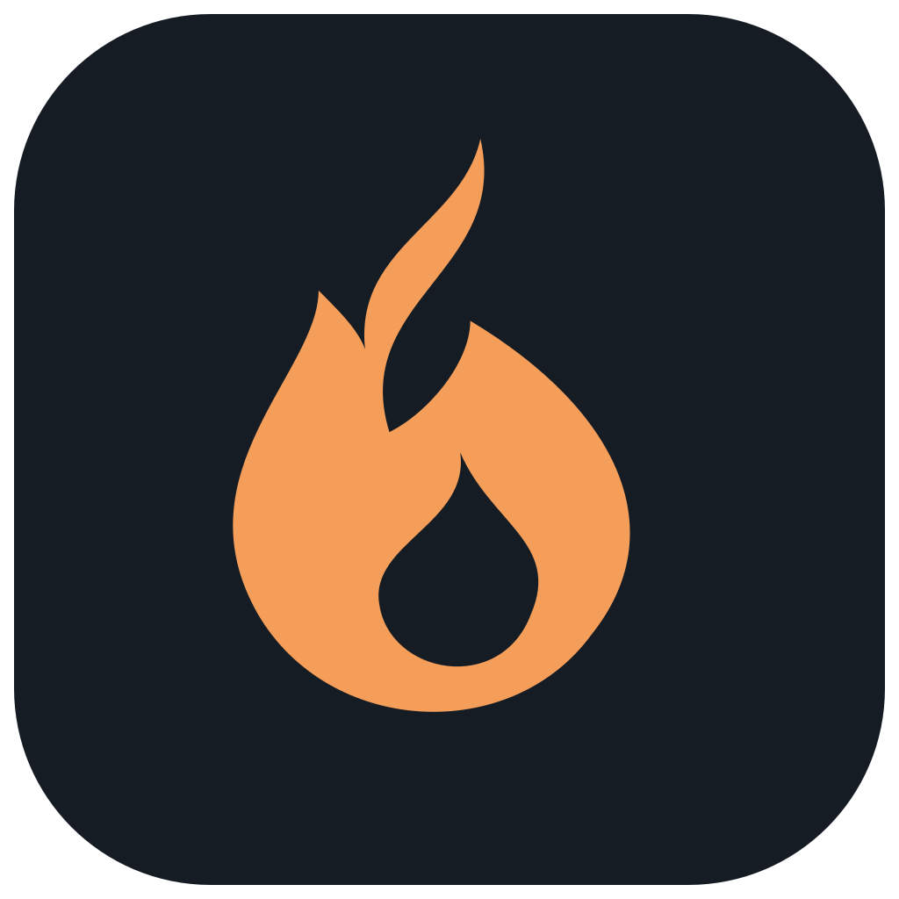
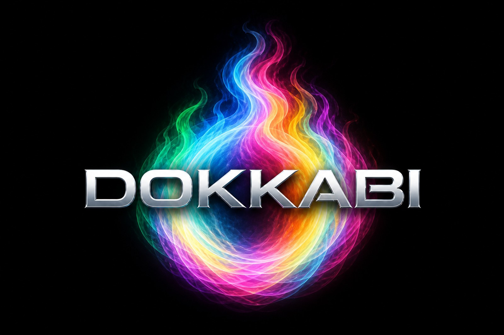

<p align="center">
  
</p>

# Dokkabi



Dokkabi (돗가비) is a coding agent harness with a macOS desktop application.
The harness/CLI supports macOS and Linux. The desktop source is in [app/](app/);
it derives from [T3 Code](https://github.com/pingdotgg/t3code), with its MIT
license and attribution retained.

## Primary research goal

**Dokkabi's central goal is to test whether harness-level verification and
contextual failure feedback improve actual coding-task success with the same
underlying model, and report the results in a reproducible research paper for
arXiv.**

The planned study compares Dokkabi with native Claude Code and other registered
coding harnesses. It asks whether detecting unsupported completion claims,
incorrect implementations and repeated failures leads to useful repair and
better final artifacts, and what that improvement costs.

- **Controlled comparison:** pin the actual model/version, benchmark tasks,
  available information and comparable total resource limits. Use a common
  independent evaluator on frozen final artifacts, including failed and
  incomplete runs.
- **Mechanism:** connect unsupported completion attempts, host refusal and
  subsequent repair to independently evaluated outcomes. Use predeclared
  ablations and effort controls to distinguish specific harness benefits from
  additional model work. An incorrect result alone does not establish lying.
- **Context and lessons:** connect semantic data with its task context in a
  Context Graph linking observations, actions, decisions and evidence. Test
  whether applicable evidence-backed lessons entering later reasoning reduce
  repeated failures.
- **Cost and uncertainty:** report success and false-completion rates alongside
  total tokens, elapsed time, retries and cost per solved task, including
  planning, verification and subsidiary model calls.

These are research hypotheses, not established superiority claims. Reliable
ordinary coding comes first; GUI features and a source release do not establish
comparative efficacy. Negative and inconclusive results remain reportable.

## Current source release

**0.1.1 is an unstable patch source release.**
Download the versioned source archive and SHA256SUMS from
[Releases](https://github.com/dhihm/dokkabi/releases/tag/v0.1.1).
The release includes both workspaces and the gateway lifetime, conversation isolation
and restart recovery fixes. Official app binaries are not available
in this release; build instructions and qualification limits are in [BUILD.md](BUILD.md).

Dokkabi connects recorded model input, executed actions, verification evidence
and visible progress. Work and Context graphs, retained Record details and
decision checkpoints help you inspect long work while keeping the main
conversation and composer available. Completion requires evidence from the
harness; a model's success statement or UI state alone does not earn acceptance.
Applicable failure observations can enter the next enabled model input.
These mechanisms are the implementation under study, not proof of correctness.

```sh
bun install --frozen-lockfile
bun run dokkabi --help
bun run dokkabi login
bun run dokkabi models
bun run dokkabi work "your task"
```

Codex GPT-6 Astra/GPT-6.1 Sol, Claude Opus 5.5/Sonnet 5.5 and Z.ai GLM 5.3/GLM
5.3 Flash are catalogued through the harness's Pi provider routes. The app shows
the authenticated catalog and selects an idle
session's model through a recorded handoff. Provider sign-in and entitlement are
required. Native Antigravity is a separate app ACP provider, with its own agent
execution and account discovery.

Use `dokkabi login` to persist provider sign-in before launching the app from
Finder. Terminal-only environment keys are not automatically available to a
Finder-launched app. Use the CLI help for model selection and command syntax.
Do not commit credentials, sessions or local configuration. See [SECURITY.md](SECURITY.md).

For source builds and manual macOS installation, see [BUILD.md](BUILD.md).
Desktop artifacts are unsigned and unnotarized; only Apple Silicon has bounded
installed-app qualification so far. Automatic updates are disabled. Source
availability does not imply every inherited T3 provider, mobile/remote feature
or experimental Dokkabi plugin is a supported release feature.

MIT for Dokkabi and the T3-derived app, with separate dependency terms.
See [LICENSE](LICENSE), [app/LICENSE](app/LICENSE), [app/UPSTREAM.md](app/UPSTREAM.md)
and [app/licenses/](app/licenses/).

Bug reports and contributions: [CONTRIBUTING.md](CONTRIBUTING.md).
